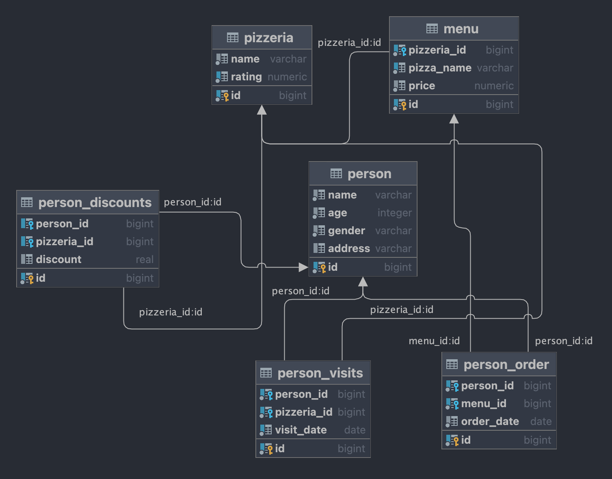
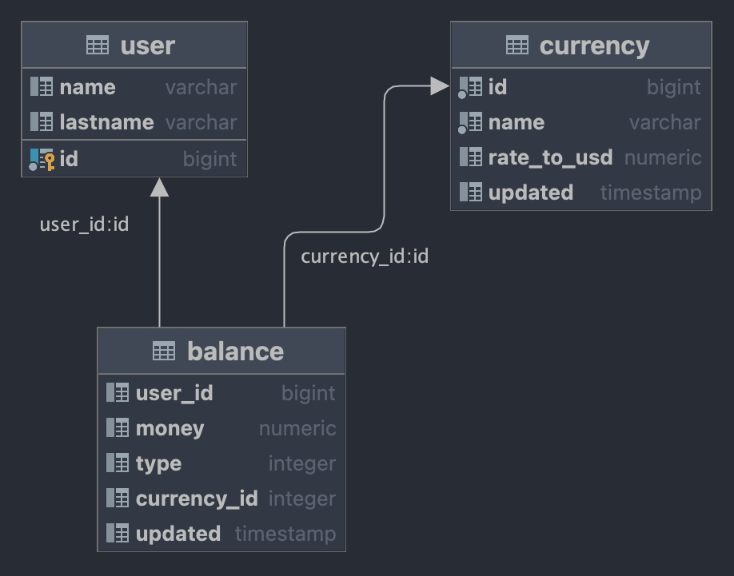

# SQL-Bootcamp
Проекты по SQL
---

	

	

## 📝 Description
SQL Bootcamp at School21 is an introduction to SQL language and databases in the intensive format: you need to complete exercises and present your solutions to other students every day to succeed at the Bootcamp.
Each module (day) in Bootcamp contains tasks dedicated to implementation of SQL statements to retrieve needed data from given database.

Database Management System used in Bootcamp is <code>PostgreSQL</code>.

IDE I used: ***DataGRIP*** from JetBrains.

## Projects

| No. |  Project name  | Description                                 | Resume | Status |
| --- | ---------------| ------------------------------------------- | ------ | ------ |
| 1   | SQL_Day00  | Relational Data Model and SQL | Today you will see how relational model works and how to get needed data based on basic constructions of SQL | ✅     |
| 2   | SQL_Day01   | First steps working with sets and JOINs in SQL | Today you will see how to get needed data based on sets constructions and simple JOINs | ✅     |
| 3   | SQL_Day02   | Deep diving into JOINs in SQL | Today you will see how to get needed data based on different structures JOINs | ✅     |
| 4   | SQL_Day03   | Continuing to JOIN and make change in data | Today you will see how to change data based on DML language | ✅     |
| 5   | SQL_Day04   | Snapshots, virtual tables… What is going on? | Today you will see how to use a virtual view and physical snapshot of data | ✅     |
| 11  | SQL_Team00  | Traveling Salesman Problem | Today you will implementing a quick solution on SQL to achieve results of Traveling Salesman Problem | ✅     |
| 6   | SQL_Day05   | I improved my SQL Query! Please, provide proof! | Today you will see how and when to create database indexes | ✅     |
| 7   | SQL_Day06   | Let's improve customer experience | Today you will see how to add a new business feature into our data model | ✅     |
| 8   | SQL_Day07   | Aggregated data is more informative, isn't it? |Today you will see how to use specific OLAP constructions to get a “Value” from data | ✅     |
| 9   | SQL_Day08   | Isolation is one of ACID properties | Today you will see how database works with transactions and isolation levels | ✅     |
| 10  | SQL_Day09   | RDBMS is not just a tables |Today you will see how to create and use functional blocks in Databases | ✅     |
| 11  | SQL_Team01  | Data Warehouse | Today you will know what DWH is and how to create a first ETL process | ✅     |

## 🔃 Schemas

### Main database schema

### Database schema for Team01 Project

